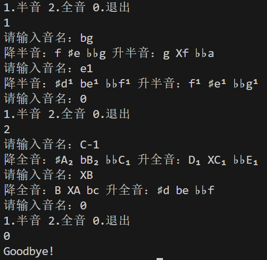

# Semitone-Or-Wholetone
最近在进行半音全音练习，即：给出一个音名，写出其 升半（全）音，降半（全）音 两个音 的 所有音名。

批改的时候总要看着琴键对答案，很麻烦，但又没有在网上找到练习程序，只好自己动手写了QAQ

输入音名，程序即可返回其两个半（全）音的所有音名

用户输入时：

大字N组用 `-N` 表示，如 C₁ 写为 C-1；

小字n组则用 `n` 表示，如 e¹ 写为 e1；

升号用 `#`（井号）表示，重升号用 `X`（字母X）表示；

降号用 `b`（字母b）表示，重降号用 `bb`（两个字母b）表示。

程序输出时：

升号用 `#` 表示，重升号用 `X` 表示；降号用 `b` 表示，重降号用 `♭♭` 表示。

使用方法如图：

